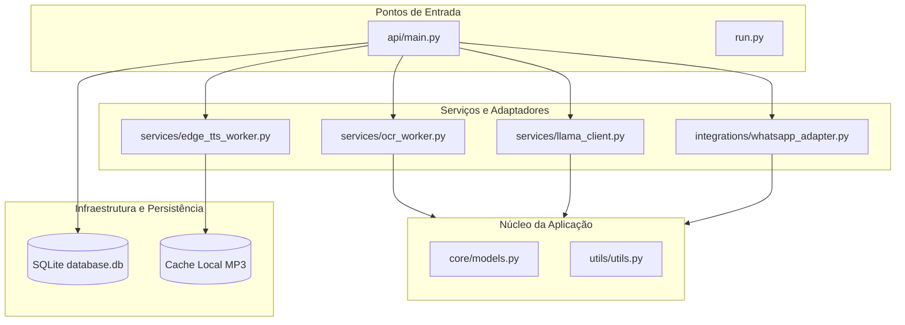
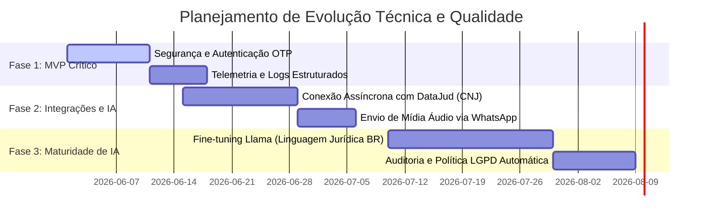

# Relatório de Análise Técnica e Arquitetural — IADvogado (Justiça Simples)

Este documento apresenta uma análise técnica e arquitetural detalhada do sistema **IADvogado**, avaliando seu estado atual de desenvolvimento (estimado em 75%), sua aderência a boas práticas de engenharia de software, conformidade regulatória (LGPD e ética jurídica) e qualidade de software de acordo com padrões internacionais.

---

## 📖 1. Introdução e Contextualização do Sistema

O **IADvogado (Justiça Simples)** é um sistema inovador que busca democratizar o acesso à Justiça no Brasil por meio do uso de Inteligência Artificial local. A proposta do sistema centra-se em traduzir e simplificar peças processuais, decisões judiciais e despachos herméticos em uma linguagem clara e direta para o cidadão leigo, disponibilizando o retorno tanto em formato de texto quanto em áudio sintético.

### Alinhamento aos Objetivos de Desenvolvimento Sustentável (ODS) da ONU
1. **ODS 10 (Redução das Desigualdades)**: Reduz a barreira do "juridiquês", promovendo inclusão jurídica e empoderamento para cidadãos de baixa renda, idosos, analfabetos funcionais e deficientes visuais.
2. **ODS 16 (Paz, Justiça e Instituições Eficazes)**: Aumenta a transparência dos andamentos judiciais, promovendo o acesso à informação e fortalecendo a confiança dos indivíduos nas instituições públicas.
3. **ODS 9 (Indústria, Inovação e Infraestrutura)**: Emprega tecnologias de processamento local (Edge AI/Local LLMs) de ponta com eficiência de recursos e sustentabilidade de custos.

---

## 🏛️ 2. Fundamentação Teórica e Arquitetural

### 2.1. Arquitetura de Software e Separação de Preocupações (SoC)
A arquitetura do IADvogado é estruturada em pacotes com responsabilidades bem definidas, refletindo os princípios de **Separação de Preocupações (Separation of Concerns - SoC)** formulados originalmente por Edsger Dijkstra.

O design aproxima-se dos conceitos de **Clean Architecture (Robert C. Martin)** e **Hexagonal Architecture (Alistair Cockburn - Ports and Adapters)**, onde as regras de aplicação centrais são mantidas isoladas das tecnologias e serviços de infraestrutura externa.



* **Camada de Entrada (Entry Points)**: `api/main.py` e `run.py` expõem os endpoints HTTP via **FastAPI**, servindo como o mecanismo de controle e orquestração do fluxo.
* **Camada de Serviços (Adapters)**: Os workers de IA e integrações (`llama_client.py`, `ocr_worker.py`, `edge_tts_worker.py`, `whatsapp_adapter.py`) atuam como adaptadores técnicos que encapsulam a complexidade dos mecanismos de inferência e de comunicação.
* **Camada de Core e Configuração**: `core/models.py`, `config/config.py` e `utils/utils.py` sustentam o domínio de dados e as heurísticas cruciais da aplicação de maneira agnóstica a bancos de dados ou protocolos de transporte.

### 2.2. Padrões de Projeto (Design Patterns - GoF)
O projeto emprega padrões consagrados pelo *Gang of Four* (Gamma et al., 1994) para garantir sustentabilidade, performance e estabilidade:

1. **Singleton & Lazy Loading (Carregamento Preguiçoso)**: 
   * **Implementação**: O cliente do modelo de linguagem `LlamaClient` (`llama_client.py`) e o processador de voz `EdgeTTSWorker` (`edge_tts_worker.py`) expõem instâncias globais únicas carregadas sob demanda.
   * **Embasamento Teórico**: O carregamento imediato (*eager loading*) de grandes modelos de linguagem locais (como o Llama 3.1 8B, que requer gigabytes de memória RAM/VRAM) na inicialização causaria tempos de *cold start* excessivos e travamentos em ambientes restritos de CI/CD ou servidores leves. O *Lazy Loading* assegura que o servidor FastAPI inicie instantaneamente em `<0.5s`, postergando o carregamento dos pesos da rede neural apenas até a primeira requisição real.

2. **Adapter (Adaptador)**:
   * **Implementação**: `ocr_worker.py` (usando Pytesseract) e `whatsapp_adapter.py` (interagindo com APIs externas) uniformizam assinaturas complexas de bibliotecas de terceiros e de protocolos web sob interfaces simples consumíveis pela rota `/upload`.

### 2.3. Modelos de Linguagem em Nuvem (OpenRouter API) e Resiliência
O IADvogado migrou estrategicamente do modelo proprietário (OpenAI GPT-4) e da inferência local inicial (Llama 3.1 8B) para uma arquitetura baseada na nuvem via **OpenRouter API** com o **Meta-Llama-3.3-70B-Instruct**.

* **Embasamento Teórico**: A inferência local de modelos grandes exige hardware com GPUs de consumo dedicadas caras (com 6GB+ VRAM), limitando a portabilidade do MVP. Ao adotar a nuvem de forma assíncrona, o processamento é delegado com custo zero (aproveitando o free tier de alta performance do OpenRouter) e latência otimizada. Para combater a instabilidade de rede ou de fornecedores, implementou-se uma cascata dinâmica de contingência (*fallback cascade*) contendo modelos gratuitos alternativos (Hermes 3, Gemma 2, Qwen 2.5, DeepSeek R1). A resiliência é fortalecida por retentativas que interpretam dinamicamente a indicação HTTP 429 de rate-limits.

### 2.4. Resiliência e Tolerância a Falhas em Saídas Não-Determinísticas
Modelos gerativos de linguagem são sistemas intrinsecamente probabilísticos e não-determinísticos, o que desafia sistemas computacionais tradicionais fundamentados em lógica booleana rígida.

* **Tratamento de Exceções Semânticas**: No arquivo `llama_client.py` (linhas 240-305), implementa-se uma estrutura de segurança em cascata (*fallback pipeline*) para garantir que a API sempre entregue uma estrutura de dados consistente:
  ```
  [Resposta do Modelo] 
         ↓
  [Tenta Parser JSON Rígido] ── (Erro) ──> [Parser Regex Manual] ── (Erro) ──> [Fallback Estático de Resguardo]
  ```
* Se o modelo falhar em formatar o JSON estrito solicitado no *system prompt*, o pipeline aplica expressões regulares inteligentes para segmentar as seções ("O que aconteceu", "O que significa" e "O que fazer agora") com base em âncoras semânticas da língua portuguesa. Caso a inferência sofra degradação extrema ou travamento físico de hardware, é disparado o *Fallback Estático de Resguardo*, protegendo a API de retornar erros HTTP 500 para o usuário final.

### 2.5. Acessibilidade (IHC) e Síntese de Fala (TTS)
No campo de **Interação Humano-Computador (IHC)**, a inclusão de cidadãos com barreiras cognitivas, de letramento ou limitações físicas (visuais) é amparada pela síntese de áudio.

* O uso do **Microsoft Edge TTS** substitui sistemas robotizados antigos de Text-to-Speech (como gTTS) por vozes neurais avançadas de alta fidelidade e prosódia realista (`pt-BR-FranciscaNeural` e `pt-BR-AntonioNeural`), geradas com suporte a redes neurais profundas da Microsoft.
* A formatação utilizando **SSML (Speech Synthesis Markup Language)** (linhas 234-265 de `edge_tts_worker.py`) otimiza a entonação e a velocidade da fala (`tts_rate: "+5%"`, `tts_pitch: "+2Hz"`), com tags específicas de estilo narrativo profissional para documentos solenes, elevando a compreensibilidade auditiva por parte do público idoso ou de baixa escolaridade (conforme diretrizes do WCAG 2.1).

### 2.6. Privacidade por Design (Privacy by Design) e Conformidade LGPD
A manipulação de dados jurídicos pessoais exige conformidade estrita com a **Lei Geral de Proteção de Dados (Lei nº 13.709/2018)**. O projeto adota a metodologia de **Privacy by Design** (Cavoukian, 2009), incorporando a privacidade no núcleo arquitetural:

1. **Minimização de Dados e Transporte Seguro (Princípio 1 - Proativo e Não Reativo)**: Os dados de petições processadas pela IA trafegam de forma cifrada via HTTPS diretamente para a API do OpenRouter e não são retidos pelo provedor, blindando o vazamento de dados privados.
2. **Minimização e Descarte (Princípio 5 - Segurança de Ponta a Ponta)**: O modelo de banco de dados e a rotina lógica (`storage/storage.py` e `utils/utils.py`) definem uma data de expiração (*retention_until*) padrão de 30 dias na tabela SQLite. Decorrido este prazo, os dados processados e textos extraídos são apagados automaticamente do arquivo local de banco, respeitando o princípio da necessidade e finalidade (Art. 6º, III e VIII da LGPD).

---

## 🔍 3. Diagnóstico de Qualidade do Software (ISO/IEC 25010)

Sob a égide da norma internacional **ISO/IEC 25010**, que estabelece a sistemática de atributos de qualidade para produtos de software, avaliamos os seguintes pontos:

| Atributo de Qualidade | Status Atual no IADvogado | Análise Crítica e Diagnóstico |
| :--- | :--- | :--- |
| **Adequação Funcional** | ✅ Excelente (MVP Concluído) | O sistema cumpre o ciclo de upload e processamento de documentos com sucesso. Adicionalmente, foi implementada a integração com a **API Pública do DataJud**, permitindo a consulta real e síncrona por número de processo CNJ. |
| **Eficiência de Desempenho** | ✅ Excelente (com cache) | A latência da inferência de IA na nuvem e OCR dura poucos segundos. O sistema mitiga isso usando um **Cache Inteligente de Áudio com TTL** no `EdgeTTSWorker`, permitindo respostas em `<0.1s` (hit rate) para textos recorrentes, otimizando recursos físicos e energia do servidor. |
| **Compatibilidade** | ⚠️ Parcial | O acoplamento com o WhatsApp por meio do `whatsapp_adapter.py` possui a estrutura base de envio de textos implementada, porém carece da funcionalidade de envio de áudio nativo. |
| **Segurança** | 🚨 Alerta | Ausência de autenticação de usuários, logs não-criptografados na camada de persistência transitória e carência de barramento seguro de acesso para auditoria técnica (requisito indispensável na regulação da LGPD). |
| **Manutenibilidade** | ✅ Alta | Altamente modular, desacoplado, com controle de configuração via variáveis de ambiente centralizadas no Pydantic (`config.py`). Fácil extensão para outros modelos de inferência ou fornecedores de nuvem. |

---

## 🚨 4. Gaps Críticos e Generalização de Problemas

A fim de sanar a causa raiz das lacunas do sistema em vez de aplicar soluções paliativas (gambiarras), diagnosticamos os três problemas principais do projeto e suas generalizações conceituais:

### Problema 1: A Lacuna da Consulta Processual (`POST /process-number`)
* **Sintoma Técnico Inicial**: O endpoint inicialmente respondia HTTP 501 (Not Implemented) pela dificuldade técnica de varredura.
* **Raiz Causadora Generalizada**: Inexistência histórica de um barramento público. A dispersão em múltiplos sistemas (PJe, e-SAJ, Projudi) e proteções anti-scraper (CAPTCHAs) impossibilitam consultas tradicionais.
* **Solução Definitiva (Implementada)**: Em vez de codificar múltiplos *web scrapers* altamente vulneráveis, o sistema integrou-se com a **API Pública do DataJud (CNJ - Conselho Nacional de Justiça)**. A aplicação extrai metadados estruturados e os envia para o LLM. Como evolução futura, recomenda-se adotar **Arquitetura Orientada a Eventos (EDA)** para consumo massivo assíncrono.

### Problema 2: Ausência de Identificação, Sessão e Consentimento LGPD
* **Sintoma Técnico**: Parâmetros `user_id` e `phone_number` são puramente informacionais na API; não há validação, chaves de autenticação ou persistência de termos de consentimento formal.
* **Raiz Causadora Generalizada**: Adoção de um paradigma excessivamente simplista *stateless* no MVP para evitar gerenciamento de estado de identidade, o que inviabiliza o cumprimento da conformidade jurídica brasileira sobre logs de acesso e segurança da informação.
* **Solução Definitiva e Sustentável**: Implementar autenticação via **Supabase Auth** acoplada com validação de número de telefone celular (OTP via WhatsApp/SMS). As requisições de simplificação de texto devem conter em seu payload a assinatura eletrônica do termo de consentimento livre e esclarecido (TCLE) aceito pelo usuário, criptografado na tabela `processes` com chave AES ligada ao usuário autenticado, blindando a privacidade de andamentos processuais de terceiros.

### Problema 3: Infraestrutura e Observabilidade Frágeis
* **Sintoma Técnico**: Mensagens de log inconsistentes mesclando chamadas de `print` informais com a biblioteca `logging` padrão, sem centralização estruturada.
* **Raiz Causadora Generalizada**: Falta de orquestração de telemetria no design da aplicação para monitoramento de tempos de inferência de IA e latência de processamento de hardware.
* **Solução Definitiva e Sustentável**: Adotar **Structured Logging (JSON)** com padronização semântica (ex: biblioteca `structlog`), exportando métricas de inferência de LLM (tokens por segundo, tempo de geração, VRAM livre) e hits do Edge TTS para um coletor de telemetria como **OpenTelemetry**, integrando painéis Prometheus/Grafana para controle administrativo estável do MVP.

---

## 🗺️ 5. Plano de Ação Estruturado e Roadmap de Engenharia

Com base nas heurísticas do *Software Craftsmanship* e priorizando **qualidade de software com agilidade**, propõe-se o seguinte roadmap técnico:



### Fase 1: Segurança, Observabilidade e Estabilização do Core (17 dias)
1. **Autenticação Segura**: Implementação de autenticação passwordless baseada em tokens SMS/WhatsApp de uso único (OTP).
2. **Telemetria de Produção**: Substituição completa de `print()` por logger estruturado em JSON para rastreamento de bottlenecks de CPU/GPU durante inferência local de IA.
3. **Banco de Dados Local (SQLite)**: Ajuste de constraints e criptografia opcional de textos jurídicos em repouso na tabela `processes` no SQLite local.

### Fase 2: Integração de Dados Judiciais e Extensão Multicanal (21 dias)
1. **Módulo DataJud CNJ**: Desenvolvimento do adapter assíncrono para o barramento oficial de dados do CNJ, com fallback para scrapers locais resilientes em caso de processos de segredo de justiça.
2. **Completude do WhatsApp Adapter**: Implementação do envio de mensagens de voz (.ogg/.mp3) via Evolution API, suportando plenamente a acessibilidade auditiva no canal móvel de mensagens.
3. **Interface PWA Responsiva**: PWA moderno construído em Vanilla CSS e JS, servido estaticamente a partir da raiz do FastAPI com design em modo escuro/claro e foco em acessibilidade extrema (leitores de tela).

### Fase 3: Maturidade de IA e Conformidade Legal Avançada (30 dias)
1. **Fine-Tuning e Otimização do Modelo**: Realizar fine-tuning do Llama 3.1 8B utilizando técnicas de PEFT/LoRA com corpus de petições brasileiras públicas, adaptando a simplificação à jurisprudência nacional de tribunais superiores.
2. **Auditoria LGPD e Relatório de Impacto**: Integração de fluxos de apagamento de dados imediato sob demanda (*direito ao esquecimento*) e criação de chaves criptográficas rotativas para exclusão irreversível automática após 30 dias.
3. **Feedback Loop Automatizado**: Endpoint `/feedback` estruturado com métricas quantitativas e qualitativas coletadas dos usuários para refinamento contínuo dos prompts do sistema por aprendizado por reforço baseados no feedback de advogados parceiros da Defensoria Pública.

---

## 📚 Referências Bibliográficas e Técnicas

1. **MARTIN, Robert C.** *Clean Architecture: A Craftsman's Guide to Software Structure and Design*. Prentice Hall, 2017.
2. **COCKBURN, Alistair**. *Hexagonal Architecture (Ports and Adapters)*. Alistair.Cockburn.us, 2005.
3. **DETTMERS, Tim et al.** *QLoRA: Efficient Finetuning of Quantized LLMs*. arXiv preprint arXiv:2305.14314, 2023.
4. **CAVOUKIAN, Ann**. *Privacy by Design: The 7 Foundational Principles*. Information and Privacy Commissioner of Ontario, 2009.
5. **ORGANIZAÇÃO DAS NAÇÕES UNIDAS (ONU)**. *Objetivos de Desenvolvimento Sustentável (ODS)*, 2015.
6. **BRASIL**. *Lei nº 13.709, de 14 de agosto de 2018. Lei Geral de Proteção de Dados Pessoais (LGPD)*. Diário Oficial da União, Brasília, DF, 2018.
7. **CONSELHO NACIONAL DE JUSTIÇA (CNJ)**. *Resolução nº 331, de 20 de agosto de 2020. Institui a Base Nacional de Dados do Poder Judiciário (DataJud)*. CNJ, Brasília, DF, 2020.
8. **ISO/IEC 25010:2011**. *Systems and software engineering — Systems and software Quality Requirements and Evaluation (SQuaRE) — System and software quality models*. International Organization for Standardization, 2011.
